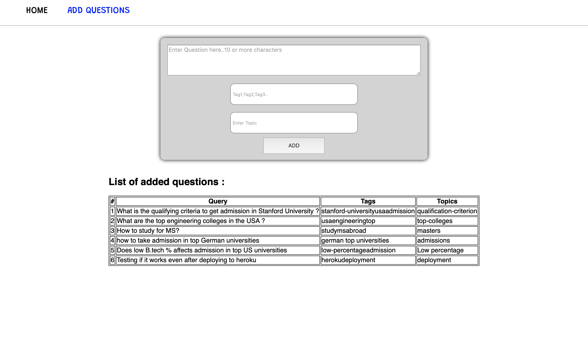

# AdmitKard-Assignment
This repository contains my take on AdmitKard's Hiring Assignment

### Hosted App URL : https://mighty-headland-72140.herokuapp.com   (might take a minute to load for the first time)

## What's the app?
This app provides the functionality of inserting Questions regarding admissions in foriegn universities, stores them into the database and then search the database for relevant questions.  
The Questions include three parameters.  
1)Query : The actual question text.  
2)Tags  : The tags associated with the question.  
3)Topic : The topic of the question.  

The App provides a Google like interface to get these questions as and when required.

## How do i run this App on my system?
1)Clone the Git repository.  
2)Navigate to the folder and type `npm install` [Make sure Node Packet Manager is installed in your system].  
3)Now type `node index`.  
4)Now change directory to `/client` using `cd client`.  
5)Type `npm start`.  
The app must automatically start in your default browser now ,if it dosent you can ping me at anuragz[dot]v1[at]gmail[dot]com. 

## What's inside there folders?
`/client` -> Contains React files.  
`/models` -> Contains models used in MongoDb.  
`/config` -> Contains Configuration files of MongoDb.   
`/routes` -> Contains various routes like /question/add etc.   
`/controllers` -> Contains controllers of various routes.    
`index.js` -> this file is the entry point of the app.   

## What technologies are used in this ?
Frontend : ReactJS.  
Backend  : NodeJS.   
Database : MongoDb (Atlas). 

## Can you show me how it looks?
Homepage/Searchpage

Add Question Page   

